# OnTheMap

- [OnTheMap](#onthemap)
  * [Implementation](#implementation)
  * [Example of user flow](#example-of-user-flow)
  * [Running Project](#running-project)
    + [Clone the project](#clone-the-project)
    + [Install dependencies](#install-dependencies)
    + [Required-tools](#required-tools)
  * [Requirements](#requirements)
    + [Background Services](#background-services)
  * [How to Contribute](#how-to-contribute)
  * [License](#license)
  * [Other Resources](#other-resources)
  
OnTheMap is the third project from the **Udacity's iOS Developer Nanodegree course** `(nd003)`.

The OnTheMap application allows Udacity students to share their location and a URL with other students.

To view this data, the OnTheMap application uses a map with pins with tags annotations for student names and URLs, which allows students to "position themselves on the map".

First, the user logs in to the app using their Udacity username and password or Facebook Account.

After login, the app downloads locations and links previously posted by other students. These links can point to any URL that a student shares. After viewing the information posted by other students, a user can post their own location and link. The locations are specified with a string and forward geocoded. They can be as specific as a full street address or as generic as "Brazil, São Paulo Atibaia"

Bonus :

1. Login with facebook OAuth2.

 Note: The Logout button when is logged in with facebook, destroy both sessions: **FB** and **Udacity**.

2. The pin in MapView has a popup with Text and icon Link to open in Safari.

## Implementation

The application has three scenes of the view controller:

- **LoginViewController** Login View: Allows the user to log in using their Udacityou credentials (and such as an additional credit exercise using their Facebook account).
- **BaseTabViewController**,**BaseMapViewController**,**MapViewController**,**TableViewController** View with Map and Table Tabs: Allows users to view the locations of other students in two formats: MapView with pins and Table View with a list.
- **PostViewController**,**PinViewController** View information view: Allows users to specify their own locations and links and preview on Map.

## Example of user flow

App opens, Login screen.

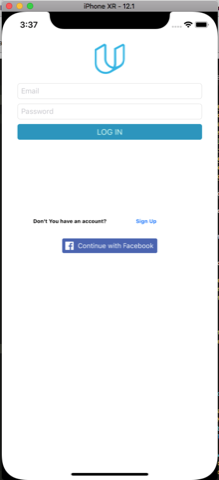

Map View, locations of students on the map.

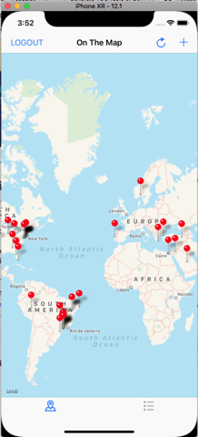

Table view, locations of students. User taps `add` `+` and goes to `PostViewController`.


User fill a location and a valid url and taps `Encontrar Local` button.

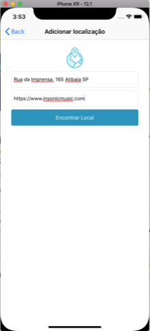

User preview the location found and taps `Finalizar` button (Look the random name returned).

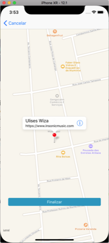

After taps the `Finalizar` button, App `UIAlertController` successfully notifies the `post` request and send the user to `TableViewController`.

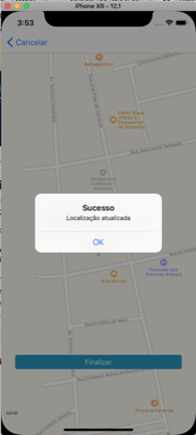

`TableViewController` refresh the data from Parse API, and show the location informed by user.

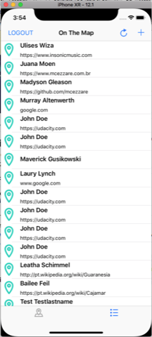

User taps the `maps` button on tab bar(bottom) and can see the location posted in Map View.
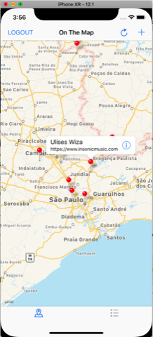

After user taps on red pin, and then taps the `!` icon on popup detail, the url informed on `PostViewController` loads into Safari.

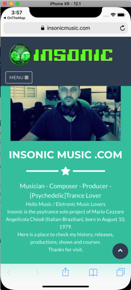

When user return to App, taps `add` `+`  and App ask if user want to update his location.

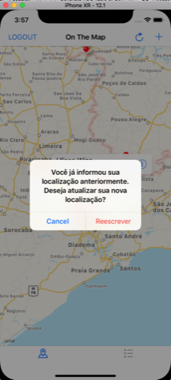

After user fill a new location, can preview it on map in `PinViewController`, taps the `Finalizar` button, App `UIAlertController` successfully notifies the `put` request and send the user to `TableViewController`.

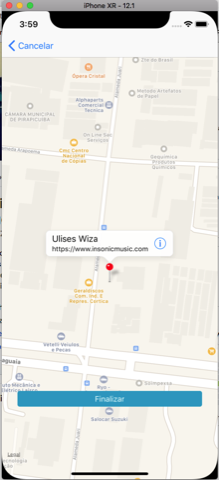

`TableViewController` refresh the data from Parse API, and show the updated location informed by user.

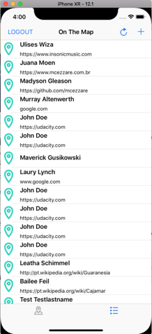

Above there is the 4 steps using logging with Facebook:

User taps the `continuar com o facebook`, APP asks permission to start the login process.

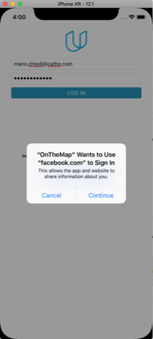

The udacity app on facebook show login screen.(check the `FacebookAppID` on `Info.plist` file).

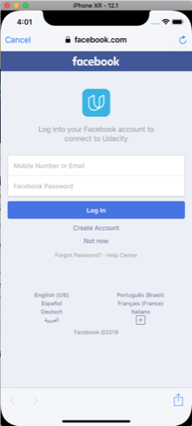

User fills FB credentials and taps `Log In` button.

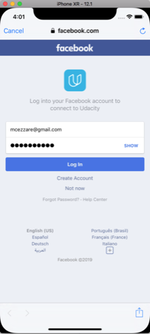

Facebook Udacity app validate your credentials and `LoginViewController` takes the token and authenticate user on Udacity API.

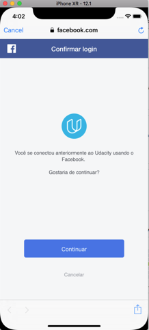

User taps the `sign in` button on `LoginViewController`.
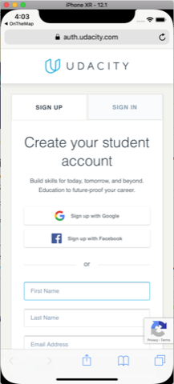

## Running Project

### Clone the project

- Note. Dependencies (thirdy party libraries from [facebook](https://developers.facebook.com/docs/ios/)) are only used to logging with Facebook. All sections use native functions of Swift 4.

### Install dependencies

```sh
pod install
```

Note: If you don't have cocoapods installed look at [required tools](#required-tools)

- After installing CocoaPods in the version fixed in the project you can run the project

```sh
pod install
```

- Open project using Workspace generated by CocoaPods:

```sh
open OnTheMap.xcworkspace
```

- With Xcode open, the build / debug process follows the pattern.

### Required-tools

To avoid damage your OS version of Ruby you can use [Rbenv](https://github.com/rbenv/rbenv) installed with [HomeBrew](https://brew.sh/)

1 - Install HomeBrew

```sh
/usr/bin/ruby -e "$(curl -fsSL https://raw.githubusercontent.com/Homebrew/install/master/install)"
```

2 - Install Rbenv

```sh
brew install rbenv
```

3 - Install version 2.5.3 of Ruby

```sh
rbenv install 2.5.3
```

4 - Inside the `OnTheMap` folder

```sh
rbenv local 2.5.3
```

This command will create a file named `.ruby-version` with this content `2.5.3`

Run

```sh
ruby --version
```

If the version listed is not 2.5.3 add the following lines to your .bash_profile our .profile and reload your xterm session

```sh
# Ruby Stuff RBenv
export PATH="$HOME/.rbenv/bin:$PATH"
eval "$(rbenv init - )"
```

And run again

```sh
rbenv local 2.5.3
ruby --version
```

5 - Now you can install cocoapods with gem command

```sh
gem install cocoapods
```

6 - Back to [Running Project](#Running-Project)

## Requirements

- A valid and active Udacity Account
- Xcode 9.2 and Swift 4
- Tools (`cocoapods`) described in [required tools](#required-tools)

### Background Services

- Udacity API: for login and get Student Information
- Parse Server: for keep the location of Users

**Note**:

During the course, I had several problems using the Parse service, from high latency to unavailability.

Aside from that, the user data also returns randomly, and never the user that logs has the id of the user who posts it, which is very strange when using the application 😞.

I chose to configure a local service (docker) to finalize the application, as soon as possible, I 'll provide a repository with the script to build the images and loads the necessary data to test the App. Contact me if you need it too.

Some **requisites** for this project to be approved:

- The application contains a `StudentInformation` structure with the appropriate properties for locations and links.
- The struct `StudentInformation` has an init() method that accepts a dictionary as an argument.
- The network code uses Swift's URLSession library, not a third-party framework.
- JSON parsing code uses Swift's JSONSerialization library or Codable, not a third-party framework.

## How to Contribute

Find any typos? Have another resource you think should be included? Contributions are welcome!

First, fork this repository. I'll be happy to know if this example is useful for you.

Next, clone this repository to your desktop to make changes.

Once you've pushed changes to your local repository, you can create a pull request with your suggestion.

It's good take a look at the [Contributing Guide](CONTRIBUTING.MD)

## License

The contents of this repository are covered under the [MIT License](LICENSE.txt).

## Other Resources

Assets : The assets package was provided from Udacity Team

The app store icons generated with this great tool: [Makeappicon](https://makeappicon.com/)

<small><i><a href='http://ecotrust-canada.github.io/markdown-toc/'>Table of contents generated with markdown-toc</a></i></small>
